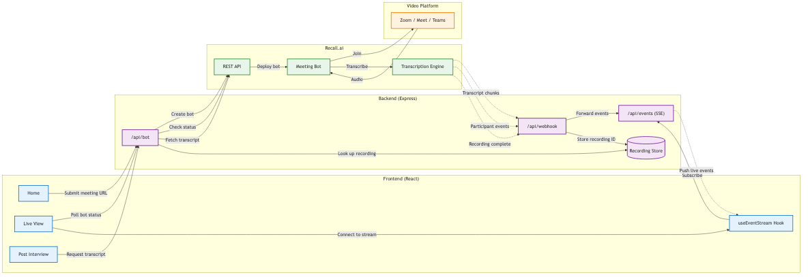
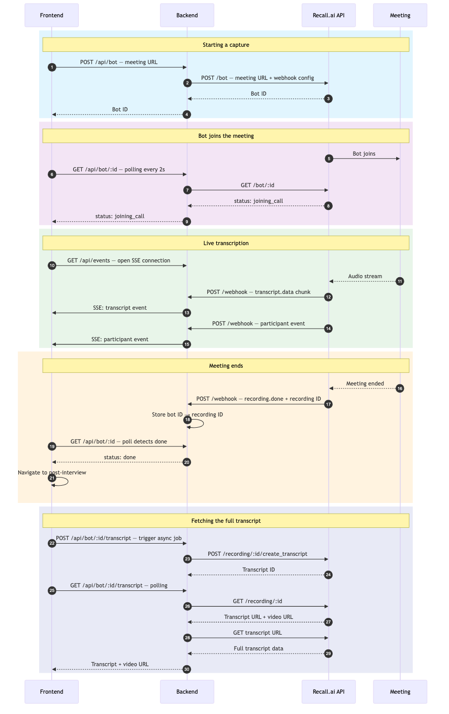

# Architecture

How the pieces fit together and why.

## System overview

The frontend communicates exclusively through the backend — it never calls Recall directly. Real-time events flow the other way: Recall sends webhooks to the backend, which re-broadcasts them over SSE. That indirection is the core pattern: it keeps the frontend decoupled from Recall's webhook contract, and lets you add processing or filtering in the backend before anything reaches the browser.

Solid lines are request-response. Dashed lines are the event-driven paths — webhooks inbound from Recall, and SSE outbound to the frontend.

## Request lifecycle

**Starting a capture** — the frontend sends a meeting URL, the backend creates a bot via the Recall API, and returns the bot ID. The `recording_config` sent to Recall is where you specify which webhook events you want and what transcription mode to use.

**Bot joins the meeting** — a polling loop. Recall doesn't push a "bot is ready" event you can wait on, so the frontend polls the bot status every 2 seconds until it progresses past `joining_call`. The LiveView page maps each status code to a visual indicator so the user knows what's happening.

**Live transcription** — the core of the demo. Once the bot is in the meeting, Recall sends `transcript.data` webhooks as speech is recognized. These are streaming chunks, not a single payload at the end. The backend receives each chunk and immediately pushes it to all connected SSE clients. The frontend's `useEventStream` hook listens for these and appends them to the transcript in real time. Participant events (join, leave, speaking) flow through the same pipeline.

**Meeting ends** — the handoff. Recall sends `recording.done` with the recording ID. The backend stores that mapping (bot ID → recording ID) because the post-interview page will need it. The status poll on the frontend detects `done` and navigates automatically.

**Fetching the full transcript** — the higher-quality version. The live transcript above is optimized for low latency. This step runs an async transcription job with full speaker diarization. The frontend polls until it's ready, then renders the final transcript alongside the video and prompt templates.

## Key files

| File | Role |
|---|---|
| `backend/src/routes/bot.ts` | All Recall API calls: create bot, poll status, trigger and fetch transcripts |
| `backend/src/routes/webhook.ts` | Receives Recall webhook events, routes them to SSE or the recording store |
| `backend/src/routes/events.ts` | SSE endpoint — holds open connections and broadcasts events to the frontend |
| `backend/src/lib/recallClient.ts` | Thin wrapper around fetch that handles the Recall base URL and auth header |
| `frontend/src/hooks/useEventStream.ts` | React hook that connects to the SSE endpoint and maintains transcript state |
| `frontend/src/pages/LiveView.tsx` | Real-time view: status polling + live transcript rendering |
| `frontend/src/pages/PostInterview.tsx` | Post-meeting view: final transcript + AI prompt templates |
